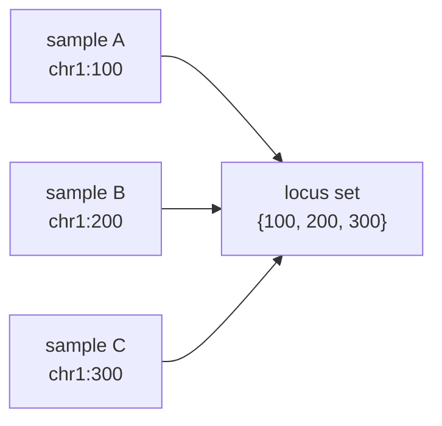
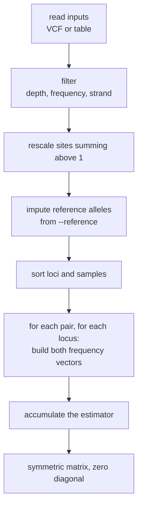

# The model

What Fstic treats as a sample, a locus and a frequency. Most surprises about a
matrix trace back to one of these three, so they are worth reading once.

## A sample is a frequency vector

Not a genotype. At each locus a sample is a set of alleles with frequencies:

```text
chr1:1043   { A: 0.18, T: 0.82 }
```

That is the point of the tool. A consensus caller would record `T` and lose the
18%; Fstic keeps both, which is what makes it usable for mixed infections,
pooled populations and deep-sequenced isolates where the minor allele is the
signal.

If your data really is one genotype per sample, that is just the degenerate
case where every frequency is 0 or 1, and the estimators behave as their
textbook definitions.

## Loci are the union of variant sites

The locus set for a run is every position that appears in **any** input, after
filtering. A run over 48 samples where each carries a few private variants has
a locus set larger than any single sample's.



Chromosome is part of the key, so `chr1:100` and `chr2:100` are different loci.

## Absent means reference

A variant-only VCF records what differs from the reference, so a sample with no
line at a locus is reference there. Fstic imputes accordingly: the reference
allele gets frequency \(1 - \sum(\text{alt frequencies})\).

At `chr1:100`, where sample A carries `T` at 0.82 and sample B has no record:

| | A | T |
| --- | --- | --- |
| sample A | 0.18 | 0.82 |
| sample B | 1.00 | 0.00 |

The reference base comes from the VCF `REF` column, or from `--reference` for
table input that omits `ref_allele`.

### When neither sample has a record

At a locus private to some third sample, neither member of the pair has a
record and no `REF` was ever read for them. They are both reference, so the
locus is scored as identity: a single allele at frequency 1 in both.

This matters more than it sounds. It is what makes a pairwise distance a
property of the pair:

!!! success "Distances do not depend on the rest of the cohort"

    Adding an unrelated sample to a run grows the locus set but contributes
    nothing to the cumulative estimators, so `gst`, `fst`, `chord`,
    `bray-curtis`, `jost_d` and `reynolds` between the existing samples do not
    move.

    `nei` and `rogers` are defined over the whole locus set, one as a ratio and
    one as a mean, so a shared monomorphic locus legitimately shifts them. That
    is the definition, not an artefact.

!!! warning "Changed in 1.0.1"

    Before 1.0.1 such loci produced empty frequency vectors instead. Chord added
    √2 per locus, so two identical samples came out at 1.41, 2.83 and upwards
    depending on cohort size, and GST took 1.0 into its denominator, halving
    just because another sample joined the run.

### The reference allele is not always known

For table input with no `ref_allele` column and a `--reference` that has no
contig of that name, the reference base cannot be recovered. Fstic still keeps
the profile a distribution by carrying the remaining mass under a placeholder
allele, and reports the unmatched contigs:

```text
Warning: 2 contig name(s) absent from the reference FASTA (chrQ, chrX).
Reference alleles were not imputed there.
```

A single-contig reference matches any contig name, so the usual `Chromosome`
against `NC_000962.3` mismatch resolves without complaint.

## Frequencies form a distribution

At each locus the frequencies are expected to sum to 1. Two things can break
that.

**Summing above 1.** Multi-allelic records split with `bcftools norm -m-any`
carry independently estimated frequencies, and 0.9 plus 0.9 is a real
possibility. Left alone, \(1 - \sum p_i^2\) goes negative and every estimator
leaves its range. Fstic rescales such sites and reports the count.

**Summing below 1.** The deficit is exactly what the reference imputation
assigns, so nothing needs doing. A row that explicitly states the reference
allele's own frequency is left as stated rather than overwritten.

## From frequencies to a matrix



Sorting before the pair loop is what makes the output reproducible: loci are
processed in genomic order and samples in name order, regardless of the order
the files arrived in.

## Bi-allelic SNPs only

The estimators are computed over allele frequency vectors of arbitrary size,
but the readers accept only single-base `REF` and `ALT`. Indels and
comma-separated multi-allelic records are skipped and counted.

Splitting multi-allelic records first does work, and gives each allele a
frequency Fstic can use:

```bash
bcftools norm -m-any input.vcf -o split.vcf
```

The site then carries several alleles, which the estimators handle natively.
