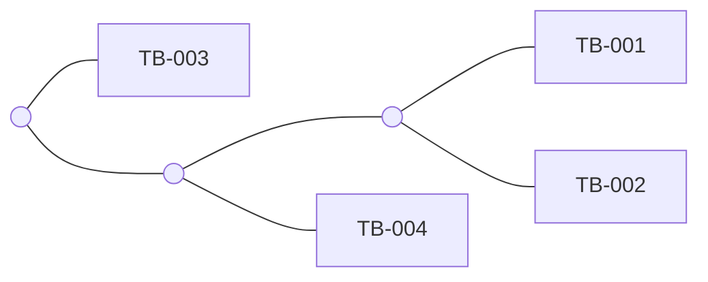

# Tutorial

A complete run on four samples, from raw VCFs to a tree, with every number on
this page produced by the commands shown. It takes about ten minutes.

The scenario is a small suspected transmission cluster: four *M. tuberculosis*
samples, one of which turns out to be a mixed infection. By the end you will
have found it in the distance matrix.

## 1. Build the example data

Save this as `make_example.py` and run it. It writes four single-sample VCFs in
the current directory, so no download is needed.

```python title="make_example.py"
#!/usr/bin/env python3
"""Write four single-sample VCFs for the Fstic tutorial."""

HEADER = (
    "##fileformat=VCFv4.2\n"
    "##contig=<ID=Chromosome,length=4411532>\n"
    "#CHROM\tPOS\tID\tREF\tALT\tQUAL\tFILTER\tINFO\tFORMAT\tsample\n"
)

ALLELES = {
    1000: ("A", "G"), 2000: ("C", "T"),  3000: ("G", "A"), 4000: ("T", "C"),
    5000: ("A", "C"), 7000: ("A", "T"),  8000: ("C", "G"), 9000: ("G", "T"),
    10000: ("T", "A"),
}

SAMPLES = {
    # Lineage A
    "TB-001": {1000: (1.00, 120, "PASS"), 2000: (1.00,  98, "PASS"),
               3000: (1.00, 110, "PASS")},
    "TB-002": {1000: (1.00, 105, "PASS"), 2000: (1.00, 115, "PASS"),
               3000: (1.00,  90, "PASS"), 4000: (1.00, 102, "PASS")},
    # Lineage B
    "TB-003": {7000: (1.00,  88, "PASS"), 8000: (1.00,  95, "PASS"),
               9000: (1.00, 101, "PASS"), 10000: (1.00, 99, "PASS")},
    # Mostly lineage A with a minority of lineage B, plus one noisy call
    "TB-004": {1000: (0.68, 130, "PASS"), 2000: (0.71, 125, "PASS"),
               3000: (0.66, 118, "PASS"), 7000: (0.32, 130, "PASS"),
               8000: (0.29, 124, "PASS"), 5000: (0.04,  80, "LowQual")},
}

for name, calls in SAMPLES.items():
    with open(f"{name}.vcf", "w") as fh:
        fh.write(HEADER)
        for pos in sorted(calls):
            freq, dp, filt = calls[pos]
            ref, alt = ALLELES[pos]
            ad = round(dp * freq)
            fh.write(
                f"Chromosome\t{pos}\t.\t{ref}\t{alt}\t.\t{filt}\t.\t"
                f"GT:DP:AD:ADR:FREQ\t1:{dp}:{ad}:{ad // 2}:{freq * 100:.1f}%\n"
            )
    print(f"wrote {name}.vcf ({len(calls)} variants)")
```

```bash
python3 make_example.py
```

```text
wrote TB-001.vcf (3 variants)
wrote TB-002.vcf (4 variants)
wrote TB-003.vcf (4 variants)
wrote TB-004.vcf (6 variants)
```

`TB-004.vcf` is the interesting one:

```vcf
#CHROM      POS   ID REF ALT QUAL FILTER  INFO FORMAT            sample
Chromosome  1000  .  A   G   .    PASS    .    GT:DP:AD:ADR:FREQ 1:130:88:44:68.0%
Chromosome  2000  .  C   T   .    PASS    .    GT:DP:AD:ADR:FREQ 1:125:89:44:71.0%
Chromosome  3000  .  G   A   .    PASS    .    GT:DP:AD:ADR:FREQ 1:118:78:39:66.0%
Chromosome  5000  .  A   C   .    LowQual .    GT:DP:AD:ADR:FREQ 1:80:3:1:4.0%
Chromosome  7000  .  A   T   .    PASS    .    GT:DP:AD:ADR:FREQ 1:130:42:21:32.0%
Chromosome  8000  .  C   G   .    PASS    .    GT:DP:AD:ADR:FREQ 1:124:36:18:29.0%
```

Nothing is at 100%. It carries the lineage A variants at about 68% and the
lineage B variants at about 30%, which is what a mixed infection looks like in
frequency space. The call at 5000 is deliberate noise: 4% frequency, three
supporting reads, one on the reverse strand, and `LowQual` in `FILTER`.

## 2. First run

Sample names come from the file names, so no other setup is needed.

```bash
fstic --vcf TB-*.vcf --output distances.csv
```

```text
--- Applying Filters ---
> Minimum Depth (DP): 30
> Minimum Allele Freq (AF): 0.05
> Minimum Alternate Reads (AD): 2
> Minimum Alt. Reverse Reads (ADR): 2
------------------------

Reading 4 input files...
Found 4 samples and 8 polymorphic sites after filtering.
Computing Fst distances for 6 pairs...

--- Summary ---
> Samples: 4
> Loci: 8
> Pairs: 6
> Formula: Fst
> Output: distances.csv
> Time: 0.00s
---------------
```

!!! tip "Read the summary first"

    Nine positions were written across the four files but only **8 loci**
    survived. The noisy call at 5000 was dropped, in this case by two filters at
    once: 4% is below `--min-af 0.05`, and one reverse read is below
    `--min-alt-rev-reads 2`. Getting into the habit of checking that number
    against what you expect will catch most configuration mistakes.

The matrix:

<table class="matrix">
<thead><tr><th>sample</th><th>TB-001</th><th>TB-002</th><th>TB-003</th><th>TB-004</th></tr></thead>
<tbody>
<tr><td>TB-001</td><td>0.0000000000</td><td>1.0000000000</td><td>7.0000000000</td><td>0.9249529446</td></tr>
<tr><td>TB-002</td><td>1.0000000000</td><td>0.0000000000</td><td>8.0000000000</td><td>1.9249529446</td></tr>
<tr><td>TB-003</td><td>7.0000000000</td><td>8.0000000000</td><td>0.0000000000</td><td>4.6236155375</td></tr>
<tr><td>TB-004</td><td>0.9249529446</td><td>1.9249529446</td><td>4.6236155375</td><td>0.0000000000</td></tr>
</tbody>
</table>

A distance of 7.0 will look wrong if you were expecting an FST. It is not.

!!! warning "The default `fst` is cumulative"

    `--formula fst` sums the per-locus Nei \(G_{ST}\) across sites, so it grows
    with the number of loci: 7.0 here means seven loci behaving as complete
    differences. Over a real genome it reaches the thousands.

    For a per-locus mean, add `--normalize`. For a number that is bounded
    without any flag, use `--formula gst`.

## 3. Normalise it

```bash
fstic --vcf TB-*.vcf --output fst_norm.csv --normalize
```

<table class="matrix">
<thead><tr><th>sample</th><th>TB-001</th><th>TB-002</th><th>TB-003</th><th>TB-004</th></tr></thead>
<tbody>
<tr><td>TB-001</td><td>0.0000000000</td><td>0.1250000000</td><td>0.8750000000</td><td>0.1156191181</td></tr>
<tr><td>TB-002</td><td>0.1250000000</td><td>0.0000000000</td><td>1.0000000000</td><td>0.2406191181</td></tr>
<tr><td>TB-003</td><td>0.8750000000</td><td>1.0000000000</td><td>0.0000000000</td><td>0.5779519422</td></tr>
<tr><td>TB-004</td><td>0.1156191181</td><td>0.2406191181</td><td>0.5779519422</td><td>0.0000000000</td></tr>
</tbody>
</table>

Now it reads: TB-001 and TB-002 differ at one locus in eight (0.125), TB-002 and
TB-003 differ at all eight (1.0), and TB-004 sits between the two groups.

## 4. Filters, and what they cost you

Loosen the frequency threshold so the noisy call at 5000 could get through:

```bash
fstic --vcf TB-*.vcf -o loose.csv --min-af 0.01
```

```text
Found 4 samples and 8 polymorphic sites after filtering.
```

Still 8. Frequency was not the only thing stopping it: the call has one reverse
read against a default of two. Drop that too:

```bash
fstic --vcf TB-*.vcf -o loose.csv --min-af 0.01 --min-alt-rev-reads 1
```

```text
Found 4 samples and 9 polymorphic sites after filtering.
```

Nine. The noise is now in the analysis. The `FILTER` column already said not to
trust it, so let Fstic use that:

```bash
fstic --vcf TB-*.vcf -o pass.csv --min-af 0.01 --min-alt-rev-reads 1 --pass-only
```

```text
Found 4 samples and 8 polymorphic sites after filtering.
```

Back to 8.

!!! note "Thresholds work together"

    A low `--min-af` is only safe with depth and strand support behind it. Here
    the frequency filter and the strand filter each caught the same bad call
    independently, which is the point of having both.

## 5. Compare estimators

They are cheap to run, and disagreement between them is informative.

=== "gst"

    ```bash
    fstic --vcf TB-*.vcf -o gst.csv --formula gst
    ```

    <table class="matrix">
    <thead><tr><th>sample</th><th>TB-001</th><th>TB-002</th><th>TB-003</th><th>TB-004</th></tr></thead>
    <tbody>
    <tr><td>TB-001</td><td>0.0000000000</td><td>1.0000000000</td><td>1.0000000000</td><td>0.1856806263</td></tr>
    <tr><td>TB-002</td><td>1.0000000000</td><td>0.0000000000</td><td>1.0000000000</td><td>0.4099245470</td></tr>
    <tr><td>TB-003</td><td>1.0000000000</td><td>1.0000000000</td><td>0.0000000000</td><td>0.6709156249</td></tr>
    <tr><td>TB-004</td><td>0.1856806263</td><td>0.4099245470</td><td>0.6709156249</td><td>0.0000000000</td></tr>
    </tbody>
    </table>

=== "rogers"

    ```bash
    fstic --vcf TB-*.vcf -o rogers.csv --formula rogers
    ```

    <table class="matrix">
    <thead><tr><th>sample</th><th>TB-001</th><th>TB-002</th><th>TB-003</th><th>TB-004</th></tr></thead>
    <tbody>
    <tr><td>TB-001</td><td>0.0000000000</td><td>0.3535533906</td><td>0.9354143467</td><td>0.2471335671</td></tr>
    <tr><td>TB-002</td><td>0.3535533906</td><td>0.0000000000</td><td>1.0000000000</td><td>0.4313641153</td></tr>
    <tr><td>TB-003</td><td>0.9354143467</td><td>1.0000000000</td><td>0.0000000000</td><td>0.7389688762</td></tr>
    <tr><td>TB-004</td><td>0.2471335671</td><td>0.4313641153</td><td>0.7389688762</td><td>0.0000000000</td></tr>
    </tbody>
    </table>

=== "jost_d"

    ```bash
    fstic --vcf TB-*.vcf -o jost.csv --formula jost_d --normalize
    ```

    <table class="matrix">
    <thead><tr><th>sample</th><th>TB-001</th><th>TB-002</th><th>TB-003</th><th>TB-004</th></tr></thead>
    <tbody>
    <tr><td>TB-001</td><td>0.0000000000</td><td>0.1250000000</td><td>0.8750000000</td><td>0.0778270882</td></tr>
    <tr><td>TB-002</td><td>0.1250000000</td><td>0.0000000000</td><td>1.0000000000</td><td>0.2028270882</td></tr>
    <tr><td>TB-003</td><td>0.8750000000</td><td>1.0000000000</td><td>0.0000000000</td><td>0.6266558994</td></tr>
    <tr><td>TB-004</td><td>0.0778270882</td><td>0.2028270882</td><td>0.6266558994</td><td>0.0000000000</td></tr>
    </tbody>
    </table>

Look at TB-001 against TB-002. Rogers says 0.354 and normalised FST says 0.125,
both of which read as "these two are close". GST says **1.000**, the same as
TB-001 against TB-003.

That is not a bug, and it is worth understanding:

!!! info "GST is a ratio over informative loci"

    GST divides the between-sample variance by the total, summed over loci.
    TB-001 and TB-002 are identical everywhere except position 4000, and at that
    one locus the difference is complete. Every locus that contributes anything
    to the denominator contributes all of it to the numerator, so the ratio
    saturates at 1.

    GST answers "of the variation that exists, how much separates them", not
    "how much variation is there". For closely related samples separated by a
    few fixed differences, that ratio saturates and you want `rogers` or
    `fst --normalize` instead.

## 6. Build a tree

Chord distance satisfies the triangle inequality, which makes it the reasonable
choice to hand to a tree builder.

```bash
fstic --vcf TB-*.vcf --output chord.csv --formula chord
```

<table class="matrix">
<thead><tr><th>sample</th><th>TB-001</th><th>TB-002</th><th>TB-003</th><th>TB-004</th></tr></thead>
<tbody>
<tr><td>TB-001</td><td>0.0000000000</td><td>1.4142135624</td><td>9.8994949366</td><td>2.9191129599</td></tr>
<tr><td>TB-002</td><td>1.4142135624</td><td>0.0000000000</td><td>11.3137084990</td><td>4.3333265223</td></tr>
<tr><td>TB-003</td><td>9.8994949366</td><td>11.3137084990</td><td>0.0000000000</td><td>7.5269878869</td></tr>
<tr><td>TB-004</td><td>2.9191129599</td><td>4.3333265223</td><td>7.5269878869</td><td>0.0000000000</td></tr>
</tbody>
</table>

=== "Python"

    ```python
    import pandas as pd
    from scipy.spatial.distance import squareform
    from scipy.cluster.hierarchy import linkage, dendrogram

    m = pd.read_csv("chord.csv", index_col=0)
    Z = linkage(squareform(m.values, checks=False), method="average")
    print(dendrogram(Z, labels=m.index.tolist(), no_plot=True)["ivl"])
    ```

    ```text
    ['TB-003', 'TB-004', 'TB-001', 'TB-002']
    ```

=== "R"

    ```r
    m <- as.matrix(read.csv("chord.csv", row.names = 1, check.names = FALSE))
    plot(hclust(as.dist(m), method = "average"))

    # or neighbour-joining
    library(ape)
    plot(nj(as.dist(m)))
    ```

The merge order tells the story:

| Step | Joined | Height |
| --- | --- | --- |
| 1 | TB-001 + TB-002 | 1.414 |
| 2 | TB-004 joins them | 3.626 |
| 3 | TB-003 joins last | 9.580 |



## 7. Reading the result

TB-001 and TB-002 form a tight pair, TB-003 sits well outside, and **TB-004 is
intermediate**: 0.247 from TB-001 but 0.739 from TB-003 in Rogers distance.

Intermediate is the signature worth noticing. A sample that is genuinely a
recent descendant of lineage A would be *close* to TB-001 and TB-002 and *far*
from TB-003, like they are. TB-004 is neither, because it is not one genotype.
It contains both, at about 68% and 30%, and the distance lands in between in
proportion.

This is what allele frequencies buy you. A consensus caller would have written
TB-004 as lineage A and thrown the 30% away, and the mixture would never have
appeared in the matrix at all.

!!! tip "Confirming a mixture"

    A distance matrix suggests a mixture; it does not prove one. Look at the
    frequency distribution of that sample's variants directly. A clean infection
    has variants near 0 or 1; a mixture shows a cluster around some intermediate
    value, here two clusters at roughly 0.68 and 0.30.

## Where to go next

<div class="grid cards" markdown>

-   :material-function-variant: __Picking the right estimator__

    ---

    All eight formulas, their ranges, and what disagreement between them means.

    [:octicons-arrow-right-24: Choosing an estimator](guide/metrics.md)

-   :material-filter-variant: __Filters on real data__

    ---

    Setting thresholds for consensus, within-host and deep amplicon work.

    [:octicons-arrow-right-24: Filtering](guide/filtering.md)

-   :material-dna: __What a distance means here__

    ---

    Absent records, the locus set, and why cohort composition does not move a
    pairwise distance.

    [:octicons-arrow-right-24: The model](how-it-works/model.md)

-   :material-table: __Frequency tables__

    ---

    Skip VCFs entirely if your frequencies are already in a spreadsheet.

    [:octicons-arrow-right-24: Input formats](getting-started/inputs.md)

</div>
